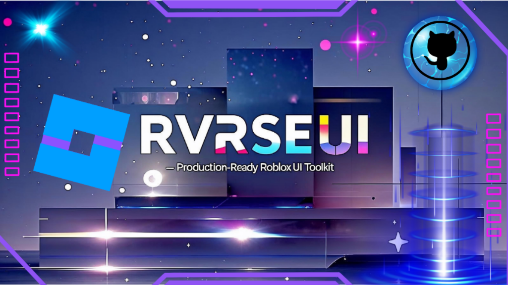

# RvrseUI v4.3.20



**Modern, Production-Ready Roblox UI Library** with Lucide Icon System, Advanced ColorPicker, Unified Multi-Select Dropdowns, and Built-in Key System

    

---

## 🚀 Quick Start (30 Seconds)

```lua
-- Load RvrseUI
local RvrseUI = loadstring(game:HttpGet("https://raw.githubusercontent.com/CoderRvrse/RvrseUI/main/RvrseUI.lua"))()

-- Create window
local Window = RvrseUI:CreateWindow({
    Name = "My Hub",
    Icon = "lucide://layout-dashboard",
    Theme = "Dark",
    ToggleUIKeybind = "K",
    ConfigurationSaving = {
        Enabled = true,
        FolderName = "MyHub",
        FileName = "Config.json"
    }
})

local Tab = Window:CreateTab({ Title = "Main", Icon = "lucide://home" })
local Section = Tab:CreateSection("Player")

-- Add a slider that SAVES automatically
Section:CreateSlider({
    Text = "Walk Speed",
    Min = 16,
    Max = 100,
    Default = 16,
    Flag = "WalkSpeed",  -- 🔑 This makes it save/load automatically!
    OnChanged = function(speed)
        game.Players.LocalPlayer.Character.Humanoid.WalkSpeed = speed
    end
})

-- CRITICAL: Call Window:Show() LAST!
Window:Show()  -- This loads saved config THEN shows UI
```

**🎯 Try it now in your executor!**

---

## 📋 Table of Contents

1. [Features](#-features)
2. [Installation](#-installation)
3. [Configuration System](#-configuration-system-the-most-important-section)
4. [All Elements Guide](#-all-elements-complete-guide)
5. [Advanced Features](#-advanced-features)
6. [Dynamic Updates](#-dynamic-updates--element-api-methods)
7. [API Reference](#-api-reference)
8. [Lucide Icon System](#-lucide-icon-system)
9. [Troubleshooting](#-troubleshooting)
10. [Examples](#-examples)

---

## 🎯 Features

### UI Elements (10 Total)
- **Button** - Click actions with ripple effects + left-aligned Lucide icon slot
- **Toggle** - On/off switches with lock groups
- **Slider** - Numeric values with live preview
- **Dropdown** - Modern multi-select lists (select one or multiple items)
- **ColorPicker** - RGB/HSV/Hex OR simple presets
- **Keybind** - Capture keyboard inputs
- **TextBox** - Text input fields
- **Label** - Static text with Lucide/emoji/icon prefix support
- **Paragraph** - Multi-line text blocks
- **Divider** - Visual separators

### System Features
- **✅ Lucide Icons** - Sprite sheet + Unicode fallbacks across tabs, buttons, labels, notifications
- **✅ Configuration Persistence** - Auto-save/load with profiles
- **✅ Theme System** - Dark/Light modes with smooth transitions
- **✅ Notification System** - Toast messages with priorities
- **✅ Hotkey Manager** - Global toggle/destroy keys
- **✅ Lock Groups** - Master/slave control relationships
- **✅ Spring Animations** - Smooth, physics-based motion
- **✅ Mobile Support** - Responsive design + controller chip
- **✅ Customizable Token Icon** - Swap the minimize chip sprite/emoji via API
- **✅ Flag System** - Direct element value access
- **✅ Key System** - Built-in authentication with HWID/User ID validation

---

## 📦 Installation

### Method 1: Direct Load (Recommended)
```lua
local RvrseUI = loadstring(game:HttpGet("https://raw.githubusercontent.com/CoderRvrse/RvrseUI/main/RvrseUI.lua"))()
```

### Method 2: Version-Specific
```lua
local version = "v4.3.20"
local url = string.format("https://raw.githubusercontent.com/CoderRvrse/RvrseUI/%s/RvrseUI.lua", version)
local RvrseUI = loadstring(game:HttpGet(url))()
```

### Method 3: Local Module (Roblox Studio)
1. Copy `RvrseUI.lua` content
2. Create ModuleScript in ReplicatedStorage
3. Paste content and name it "RvrseUI"
4. Require it: `local RvrseUI = require(game.ReplicatedStorage.RvrseUI)`

---

## 🔧 Configuration System (THE MOST IMPORTANT SECTION!)

### ⚠️ CRITICAL: Understanding the Flag System

**The #1 confusion point:** How do saves/loads work?

**Answer: Use the `Flag` parameter!**

```lua
-- ❌ WRONG - This won't save
Section:CreateSlider({
    Text = "Walk Speed",
    Min = 16,
    Max = 100,
    Default = 16,
    OnChanged = function(speed)
        -- Value changes here, but never saves
    end
})

-- ✅ CORRECT - This saves automatically
Section:CreateSlider({
    Text = "Walk Speed",
    Min = 16,
    Max = 100,
    Default = 16,
    Flag = "WalkSpeed",  -- 🔑 ADD THIS!
    OnChanged = function(speed)
        -- Value changes AND saves automatically
    end
})
```

### How Flags Work (Read This Carefully!)

1. **Without `Flag`**: Element works, but value is never saved
2. **With `Flag`**: Element value auto-saves when changed
3. **Access saved value**: `RvrseUI.Flags["WalkSpeed"]:Get()`
4. **Set value programmatically**: `RvrseUI.Flags["WalkSpeed"]:Set(50)`

### Auto Hydration on Load (New!)

Starting with v4.3.2 (and continuing in v4.3.8), flag-based elements (slider, toggle, color picker, text box, etc.) automatically
re-fire their `OnChanged` callbacks right after configurations are restored. This means gameplay logic
wired inside `OnChanged` runs immediately when a profile loads—no more manual hydration code.

- To **opt out** for a specific element, pass `FireOnConfigLoad = false`.
- You can still call `RvrseUI.Flags["MyFlag"]:Hydrate()` on supported elements (toggle, slider,
  color picker, text box) if you need to reapply values later.
- Hydration runs after values are assigned, so `Get()` returns the restored state before the callback
  fires.

```lua
Section:CreateToggle({
    Text = "Auto Farm",
    Flag = "AutoFarm",
    FireOnConfigLoad = false, -- opt out if the handler is expensive
    OnChanged = function(enabled)
        getgenv().AutoFarmEnabled = enabled
        -- custom logic...
    end
})
```

### Complete Configuration Example

```lua
local Window = RvrseUI:CreateWindow({
    -- 📌 BASIC SETTINGS
    Name = "My Hub",                    -- Window title
    Icon = "lucide://gamepad-2",        -- Window icon (lucide recommended)
    Theme = "Dark",                     -- "Dark" or "Light"

    -- 📌 HOTKEYS
    ToggleUIKeybind = "K",              -- Press K to toggle UI
    EscapeKey = Enum.KeyCode.Backspace, -- Press Backspace to destroy UI

    -- 📌 CONFIGURATION PERSISTENCE (CRITICAL!)
    ConfigurationSaving = {
        Enabled = true,                 -- Turn on save/load
        FolderName = "MyHub",          -- Creates: workspace/MyHub/
        FileName = "Config.json",       -- File: MyHub/Config.json
        AutoSave = true                 -- Auto-save on every change (optional)
    },

    -- 📌 PROFILES TAB (OPTIONAL)
    ConfigurationManager = {
        Enabled = true,                 -- Show "Profiles" tab
        TabName = "Profiles",          -- Tab name
        Icon = "lucide://folder"       -- Tab icon
    },

    -- 📌 LOADING SCREEN
    LoadingTitle = "My Hub",
    LoadingSubtitle = "Loading features...",

    -- 📌 ADVANCED (OPTIONAL)
    Debug = false,                     -- Force-disable RvrseUI debug logging (locked)
    DisableBuildWarnings = false,      -- Hide startup notification
    Container = "PlayerGui",            -- Where to place UI
    DisplayOrder = 100000               -- Z-index
})
```

### Configuration Save Locations

**Where are configs saved?**
- Synapse X: `workspace/`
- Script-Ware: `workspace/`
- Krnl: `workspace/`
- Other executors: Check your executor's `writefile` directory

**File structure:**
```
workspace/
└── MyHub/              ← FolderName
    ├── Config.json     ← FileName (default profile)
    ├── Profile1.json   ← Saved profile
    └── Profile2.json   ← Another profile
```

### Manual Save/Load

```lua
-- Save current configuration
local success, message = RvrseUI:SaveConfiguration()
if success then
    print("✅ Config saved:", message)
end

-- Load configuration
local success, message = RvrseUI:LoadConfiguration()
if success then
    print("✅ Config loaded:", message)
end

-- Toggle auto-save
RvrseUI:SetAutoSaveEnabled(false)  -- Pause auto-save
RvrseUI:SetAutoSaveEnabled(true)   -- Resume auto-save
```

---

## 📚 All Elements (Complete Guide)

### 1. Button

**What it does:** Clickable button that triggers a callback

**Lucide ready:** Pass `Icon = "lucide://sparkles"` (or emoji / `rbxassetid://123`) to render a 24px icon left of the text. Icons auto-space from the label, so fallbacks never overlap.

```lua
local myButton = Section:CreateButton({
    Text = "Click Me",                  -- Button label
    Icon = "lucide://flash",            -- Optional Lucide/emoji/asset icon
    Callback = function()
        print("Button clicked!")
    end
})

-- API Methods
myButton:Set("New Text")               -- Change button text
```

**Use case:** Actions that don't need state (teleport, reset character, etc.)

---

### 2. Toggle

**What it does:** On/Off switch with state persistence

```lua
local myToggle = Section:CreateToggle({
    Text = "Enable Flight",
    State = false,                     -- Initial state (default: false)
    Flag = "FlightEnabled",            -- 🔑 Saves automatically!
    OnChanged = function(enabled)
        if enabled then
            print("Flight ON")
        else
            print("Flight OFF")
        end
    end
})

-- API Methods
myToggle:Set(true, silent)             -- Set state (silent = don't trigger callback)
local state = myToggle:Get()           -- Get current state
```

**Use case:** Features that can be on or off (ESP, flight, speed hacks)

---

### 3. Slider

**What it does:** Numeric value selector with visual feedback

```lua
local mySlider = Section:CreateSlider({
    Text = "Walk Speed",
    Min = 16,                          -- Minimum value
    Max = 100,                         -- Maximum value
    Step = 2,                          -- Increment (optional, default: 1)
    Default = 16,                      -- Starting value
    Suffix = " studs/s",              -- Text after value (optional)
    Flag = "WalkSpeed",                -- 🔑 Saves automatically!
    OnChanged = function(value)
        game.Players.LocalPlayer.Character.Humanoid.WalkSpeed = value
    end
})

-- API Methods
mySlider:Set(50)                       -- Set value
mySlider:SetRange(0, 200, 10)         -- Change min/max/step
mySlider:SetSuffix(" mph")            -- Change suffix
local value = mySlider:Get()          -- Get current value
```

**Use case:** Any numeric setting (speed, jump power, FOV, brightness)

---

### 4. Dropdown

**What it does:** Multi-select list of options (users can select one or multiple items)

**Modern Multi-Select System** (unified as of v4.1.0)

```lua
local myDropdown = Section:CreateDropdown({
    Text = "Select Weapons",
    Values = {"Sword", "Bow", "Staff", "Axe"},

    CurrentOption = {"Sword"},      -- Pre-select items (optional)
    Flag = "SelectedWeapons",        -- 🔑 Saves automatically!
    OnChanged = function(selected)
        -- selected is ALWAYS a table: {"Sword", "Bow"}
        print("Selected:", table.concat(selected, ", "))

        -- For single selection, just click one item:
        if #selected == 1 then
            print("Single weapon:", selected[1])
        end
    end
})

-- API Methods
myDropdown:Set({"Bow", "Staff"})                  -- Set selections
myDropdown:Refresh({"New", "Options", "List"})     -- Update options
local weapons = myDropdown:Get()                   -- Returns array
myDropdown:SelectAll()                             -- Select all options
myDropdown:ClearAll()                              -- Clear all selections
print(#weapons, "weapons selected")                -- Count selections
```

**Use cases:**
- Select single item: Click once (e.g., weapon, difficulty, game mode)
- Select multiple items: Click multiple times (e.g., enable multiple features)

**Key Features:**
- ✅ **Always returns a table** - `OnChanged` receives `{"Item1", "Item2"}`
- ✅ **Checkbox interface** - Visual checkboxes for multi-selection
- ✅ **Dynamic overlay** - Dropdown renders above all other UI elements
- ✅ **No ZIndex issues** - Never renders behind panels

---

### 5. ColorPicker

**What it does:** Color selector with advanced controls

#### Simple Mode (8 Preset Colors)
```lua
local simpleColor = Section:CreateColorPicker({
    Text = "Theme Color",
    Default = Color3.fromRGB(255, 0, 0),           -- Red
    Advanced = false,                               -- Simple mode
    Flag = "ThemeColor",                            -- 🔑 Saves automatically!
    OnChanged = function(color)
        print("Color:", color)
    end
})
```

#### Advanced Mode (RGB/HSV/Hex Sliders)
```lua
local advancedColor = Section:CreateColorPicker({
    Text = "Custom Color",
    Default = Color3.fromRGB(88, 101, 242),        -- Discord Blurple
    Advanced = true,                                -- Advanced mode (default)
    Flag = "CustomColor",                           -- 🔑 Saves automatically!
    OnChanged = function(color)
        -- Update UI elements
        game.StarterGui.ScreenGui.Frame.BackgroundColor3 = color
    end
})

-- Advanced mode includes:
-- • RGB sliders (0-255)
-- • HSV sliders (H: 0-360, S/V: 0-100%)
-- • Hex input (#RRGGBB)
-- • Live preview circle
-- • All modes stay in sync!
```

**API Methods:**
```lua
advancedColor:Set(Color3.fromRGB(255, 0, 255))    -- Set color
local color = advancedColor:Get()                  -- Get current color
```

**Use case:** Theme customization, ESP colors, UI tinting

---

### 6. Keybind

**What it does:** Captures keyboard input for hotkeys

```lua
local myKeybind = Section:CreateKeybind({
    Text = "Dash Key",
    Default = Enum.KeyCode.Q,                      -- Default key
    Flag = "DashKey",                               -- 🔑 Saves automatically!
    OnChanged = function(key)
        print("Dash key changed to:", key.Name)
    end,

    -- Special flags (optional):
    IsUIToggle = true,    -- Makes this control UI toggle key
    IsUIEscape = true     -- Makes this control UI destroy key
})

-- API Methods
myKeybind:Set(Enum.KeyCode.E)                     -- Change key
local key = myKeybind:Get()                        -- Get current key
```

**Use case:** Rebindable hotkeys for features

---

### 7. TextBox

**What it does:** Single-line text input

```lua
local myTextBox = Section:CreateTextBox({
    Text = "Player Name",
    PlaceholderText = "Enter name...",             -- Hint text
    Default = "Guest",                              -- Starting value
    Flag = "PlayerName",                            -- 🔑 Saves automatically!
    OnChanged = function(text)
        print("Text changed:", text)
    end,
    OnEnter = function(text)
        print("Enter pressed:", text)
    end
})

-- API Methods
myTextBox:Set("NewValue")                          -- Set text
local text = myTextBox:Get()                       -- Get current text
```

**Use case:** Username input, custom messages, search fields

---

### 8. Label

**What it does:** Static text display with optional icon prefix

**Lucide ready:** Use `Icon = "lucide://sparkles"` (or emoji / `rbxassetid://123`) to place a 24px icon to the left of the label while keeping text aligned.

```lua
local myLabel = Section:CreateLabel({
    Text = "Status: Ready",
    Icon = "lucide://check-circle"                -- Optional icon
})

-- API Methods
myLabel:Set("Status: Active")                      -- Update text
```

**Use case:** Status messages, instructions, headers

---

### 9. Paragraph

**What it does:** Multi-line text block

```lua
Section:CreateParagraph({
    Text = "Welcome to My Hub!\n\nFeatures:\n• Auto Farm\n• ESP\n• Speed Hack"
})
```

**Use case:** Descriptions, changelogs, instructions

---

### 10. Divider

**What it does:** Visual separator between elements

```lua
Section:CreateDivider()
```

**Use case:** Organize sections visually

---

## 🔥 Advanced Features

### Lock Groups (Master/Slave Controls)

**Problem:** Some settings conflict with each other
**Solution:** Lock groups automatically disable conflicting options

```lua
-- Scenario: Auto Farm should disable manual farming options

-- Master toggle
Section:CreateToggle({
    Text = "🎯 Auto Farm (Master)",
    LockGroup = "AutoFarm",           -- Creates the lock
    Flag = "AutoFarmMaster"
})

-- These get disabled when master is ON:
Section:CreateToggle({
    Text = "Manual Farm Coins",
    RespectLock = "AutoFarm",        -- Obeys the lock
    Flag = "ManualCoins"
})

Section:CreateSlider({
    Text = "Farm Speed",
    Min = 1,
    Max = 10,
    RespectLock = "AutoFarm",        -- Slider also obeys lock!
    Flag = "FarmSpeed"
})
```

**When master is ON:**
- All child controls become disabled (grayed out)
- Prevents users from creating conflicting settings
- Automatically re-enables when master turns OFF

---

### 🔐 Key System (Authentication)

**Protect your hub with a key system!** RvrseUI includes built-in key validation with multiple authentication methods, Discord webhook logging, and 100% Rayfield compatibility.

#### Basic Key System (Rayfield Compatible)

```lua
local Window = RvrseUI:CreateWindow({
    Name = "Protected Hub",

    -- Enable key system
    KeySystem = true,

    KeySettings = {
        -- UI Configuration
        Title = "My Hub - Authentication",
        Subtitle = "Enter your key to continue",
        Note = "Visit myhub.gg/key to get a key",

        -- Simple key validation
        Key = "MySecretKey123",  -- Single key (Rayfield compatible)

        -- OR multiple keys
        -- Keys = {"VIPKey2024", "AdminKey999", "DevKey123"},

        -- Save key locally
        SaveKey = true,
        FileName = "MyHubKey",

        -- Security settings
        MaxAttempts = 3,         -- Attempts before kick
        KickOnFailure = true     -- Kick player if validation fails
    }
})

-- If execution reaches here, key was validated successfully!
```

#### Advanced Validation Methods

**1. Multiple Valid Keys**
```lua
KeySettings = {
    Keys = {"VIPKey2024", "AdminKey999", "TrialKey"},
    SaveKey = true,
    FileName = "License"
}
```

**2. Remote Key Fetching (Pastebin/GitHub)**
```lua
KeySettings = {
    GrabKeyFromSite = true,
    Key = "https://pastebin.com/raw/YourKeyHere",  -- Fetches key from URL
    SaveKey = true
}
```

**3. HWID/User ID Whitelist**
```lua
KeySettings = {
    Whitelist = {
        "123456789",           -- User ID
        "HWID-ABC123",         -- Hardware ID
        "ManualOverride"       -- Manual key
    },
    MaxAttempts = 3
}
```

**4. Custom Validator Function**
```lua
KeySettings = {
    Validator = function(inputKey)
        -- Example: Key changes daily
        local dailyKey = "KEY-" .. os.date("%Y%m%d")
        if inputKey == dailyKey then
            return true
        end

        -- Or validate against external API
        local success, response = pcall(function()
            return game:HttpGet("https://api.example.com/validate?key=" .. inputKey)
        end)

        return success and response == "valid"
    end,
    SaveKey = false  -- Don't save since key changes
}
```

#### Discord Webhook Logging

Log all key attempts to Discord:

```lua
KeySettings = {
    Keys = {"SecretKey2024"},

    -- Discord webhook URL
    WebhookURL = "https://discord.com/api/webhooks/YOUR_WEBHOOK_HERE",

    MaxAttempts = 3
}
```

**Webhook sends:**
- Username & User ID
- Input key
- Validation result (success/failure)
- Timestamp
- Attempts remaining

#### "Get Key" Button

Add a button to help users get keys:

```lua
KeySettings = {
    Note = "Click below to get your key",

    NoteButton = {
        Text = "🔑 Get Key",
        Callback = function()
            -- Copy link to clipboard
            setclipboard("https://myhub.gg/getkey")

            RvrseUI:Notify({
                Title = "Link Copied!",
                Message = "Key shop link copied to clipboard",
                Type = "success"
            })
        end
    },

    Keys = {"PremiumKey2024"}
}
```

#### Custom Callbacks

React to key validation events:

```lua
KeySettings = {
    Keys = {"TestKey123"},

    -- Called when valid key entered
    OnKeyValid = function(validKey)
        print("✓ User authenticated with:", validKey)

        RvrseUI:Notify({
            Title = "Welcome!",
            Message = "Access granted",
            Type = "success"
        })
    end,

    -- Called when invalid key entered
    OnKeyInvalid = function(invalidKey, attemptsLeft)
        warn("Failed attempt:", invalidKey, "- Remaining:", attemptsLeft)
    end,

    -- Called when attempts exhausted
    OnAttemptsExhausted = function()
        print("⚠️ User ran out of attempts")
        -- Custom action (e.g., redirect to purchase page)
    end,

    KickOnFailure = false  -- Handle manually in callbacks
}
```

---

### Notification System

```lua
-- Basic notification
RvrseUI:Notify({
    Title = "Success!",
    Message = "Action completed",
    Duration = 3,                    -- Seconds (optional, default: 4)
    Type = "success",                -- "success", "info", "warn", "error"
    Icon = "lucide://bell-ring"      -- Optional: lucide/emoji/asset icon
})

-- With priority
RvrseUI:Notify({
    Title = "CRITICAL ERROR",
    Message = "Something went wrong!",
    Type = "error",
    Priority = "critical",           -- "critical", "high", "normal", "low"
    Duration = 10
})
```

**Types:**
- `success` - Green, checkmark icon
- `info` - Blue, info icon
- `warn` - Yellow, warning icon
- `error` - Red, error icon

**Lucide ready:** Provide `Icon = "lucide://..."` (or emoji / `rbxassetid://...`) to show a custom notification glyph. Icons share the same 24px lane used by tabs/buttons/labels.

---

### Theme System

```lua
-- Switch theme
RvrseUI:SetTheme("Light")          -- "Dark" or "Light"

-- Theme auto-saves if ConfigurationSaving is enabled!
```

---

### Flag System (Direct Access)

**Access any element's value directly:**

```lua
-- Get value from any flagged element
local speed = RvrseUI.Flags["WalkSpeed"]:Get()

-- Set value programmatically
RvrseUI.Flags["WalkSpeed"]:Set(50)

-- Check if flag exists
if RvrseUI.Flags["WalkSpeed"] then
    print("Walk speed element exists!")
end

-- IMPORTANT: Use RvrseUI.Flags, NOT Window.Flags!
```

---

## 🔄 Dynamic Updates & Element API Methods

**All elements can be updated programmatically after creation!**

### Common Methods (All Elements)

```lua
-- Show/hide elements dynamically
element:SetVisible(true)   -- Show the element
element:SetVisible(false)  -- Hide the element

-- Get/set current value (most elements)
local value = element:Get()  -- Get current value
element:Set(newValue)        -- Set new value
```

### Real-World Update Examples

#### Live Player Stats Display

```lua
-- Create status labels
local coinsLabel = Section:CreateLabel({ Text = "Coins: 0" })
local levelLabel = Section:CreateLabel({ Text = "Level: 1" })

-- Update loop
game:GetService("RunService").Heartbeat:Connect(function()
    coinsLabel:Set("Coins: " .. tostring(playerCoins))
    levelLabel:Set("Level: " .. tostring(playerLevel))
end)
```

#### Dynamic Dropdown Based on Game State

```lua
local weaponDropdown = Section:CreateDropdown({
    Text = "Equip Weapon",
    Values = {},
    Flag = "EquippedWeapon"
})

-- Function to update available weapons
local function updateWeaponList()
    local inventory = getPlayerInventory()  -- Your inventory function
    weaponDropdown:Refresh(inventory)
end

-- Update when inventory changes
game.Players.LocalPlayer.Inventory.ChildAdded:Connect(updateWeaponList)
```

#### Using RvrseUI.Flags for Cross-Element Updates

```lua
-- Create elements with flags
local speedSlider = Section:CreateSlider({
    Text = "Walk Speed",
    Min = 16,
    Max = 100,
    Default = 16,
    Flag = "WalkSpeed"  -- Accessible via RvrseUI.Flags
})

local resetButton = Section:CreateButton({
    Text = "Reset to Default",
    OnClick = function()
        -- Access any flagged element via RvrseUI.Flags
        RvrseUI.Flags["WalkSpeed"]:Set(16)

        -- You can update multiple elements at once
        if RvrseUI.Flags["JumpPower"] then
            RvrseUI.Flags["JumpPower"]:Set(50)
        end
        if RvrseUI.Flags["GodMode"] then
            RvrseUI.Flags["GodMode"]:Set(false)
        end
    end
})
```

---

## 📖 API Reference

### Window API

```lua
local Window = RvrseUI:CreateWindow(config)

-- Methods
Window:CreateTab({ Title = "Main", Icon = "lucide://layout-dashboard" })  -- Icon accepts lucide://, emoji, asset IDs
Window:Show()                        -- CRITICAL: Call this LAST!
Window:SetTitle("New Title")
Window:SetIcon("lucide://sparkles")  -- Window icon also supports Lucide sprites
Window:Destroy()
```

### Tab API

```lua
local Tab = Window:CreateTab({ Title = "Main", Icon = "lucide://settings" })

-- Methods
Tab:CreateSection("Section Name")
Tab:SetIcon("🔧")
```

### Section API

```lua
local Section = Tab:CreateSection("Player Features")

-- Element Factories
Section:CreateButton(config)
Section:CreateToggle(config)
Section:CreateSlider(config)
Section:CreateDropdown(config)
Section:CreateColorPicker(config)
Section:CreateKeybind(config)
Section:CreateTextBox(config)
Section:CreateLabel(config)
Section:CreateParagraph(config)
Section:CreateDivider()

-- Methods
Section:SetVisible(true/false)
Section:Update("New Section Title")
```

### Global API

```lua
RvrseUI:Notify(config)                -- Show notification
RvrseUI:SaveConfiguration()           -- Manual save
RvrseUI:LoadConfiguration()           -- Manual load
RvrseUI:SetTheme("Dark"/"Light")     -- Switch theme
RvrseUI:SetAutoSaveEnabled(bool)     -- Toggle auto-save
RvrseUI:SetTokenIcon(icon, opts)     -- Change minimize token icon (lucide://, emoji, asset)
RvrseUI:GetTokenIcon()               -- Read current token icon, color override, fallback
RvrseUI:EnableDebug(true)            -- Enable debug logging
RvrseUI:LockDebug(false)             -- Hard-disable debug logging (ignores later EnableDebug calls)
RvrseUI:UnlockDebug()                -- Remove hard lock on debug logging
RvrseUI:IsDebugLocked()              -- Check if debug logging is hard-locked
RvrseUI:GetVersionInfo()             -- Get version info
RvrseUI.Flags                        -- Access all flagged elements
```

**Debug control tips**
- `Debug = false` inside `CreateWindow` hard-mutes all internal diagnostics.
- Pass a table to keep the option user-toggleable: `Debug = { Enabled = false, Lock = false }`.
- Any call to `RvrseUI:LockDebug(value)` wins over later `EnableDebug` attempts until `UnlockDebug()` runs.

---

### 🎮 Minimize Token & Controller Chip

The controller chip (the little token you minimize into) now uses the same Lucide-aware resolver as the rest of the UI. You can swap it globally **without editing core files** or override it per window.

```lua
-- Global defaults (applies to every future window)
RvrseUI:SetTokenIcon("lucide://sparkles", {
    Color = Color3.fromRGB(255, 180, 255), -- optional tint (omit for theme accent)
    Fallback = "✨"                         -- shown if sprite sheet missing
})

-- Per-window override at creation time
local Window = RvrseUI:CreateWindow({
    Name = "Dashboard",
    TokenIcon = "lucide://settings",        -- or ControllerIcon = ...
    TokenIconColor = Color3.fromRGB(115, 194, 251),
    TokenIconFallback = "⚙️"
})

-- Load existing configuration (fires hydration callbacks automatically)
local ok, message = RvrseUI:LoadConfiguration()
print("Config load:", ok, message)

-- Adjust an existing window after build
Window:SetTokenIcon("lucide://gamepad-2", { UseThemeColor = true })
```

**Supported icon formats:** `lucide://name`, `icon://unicode-name`, direct emoji (`"🔥"`), `rbxassetid://12345678`, or a plain numeric asset ID. Pass `false` as the icon to hide the sprite and rely purely on the fallback glyph.

`RvrseUI:SetTokenIcon(nil, { Reset = true })` restores the default (`lucide://gamepad-2` with a 🎮 fallback) alongside theme-driven coloring.

---

## ✨ Lucide Icon System

RvrseUI v4.3.8 ships with a unified icon pipeline that keeps every element in sync—tabs, notifications, buttons, labels, and doc demos all pull from the same resolver.

- **Supported schemes:** `lucide://home`, `icon://⭐`, direct emoji (`"🔥"`), `rbxassetid://16364871493`, or plain asset IDs (`"16364871493"`).
- **Sprite sheet first:** `lucide://` icons render from the embedded Lucide atlas (`_G.RvrseUI_LucideIconsData`) with themed tinting and automatic Unicode fallbacks.
- **Zero overlap:** Buttons and labels reserve a 24px icon lane, so fallback glyphs never collide with text.
- **Roblox assets:** `rbxassetid://` routes through an ImageLabel so custom uploads appear exactly where lucide sprites would.

### Quick Demo

```lua
local docs = Window:CreateTab({ Title = "Docs", Icon = "lucide://library" })
local section = docs:CreateSection("Lucide Icons")

section:CreateButton({
    Text = "Open Config",
    Icon = "lucide://settings",
    OnClick = function() print("Settings clicked") end
})

section:CreateLabel({
    Text = "Roblox asset id",
    Icon = "rbxassetid://16364871493"
})
```

> **Try it live:** `examples/test-lucide-icons.lua` walks through Tabs, Notifications, Buttons, and Labels with mixed icon sources. Drop it into your executor or Studio to verify the sprite sheet is loading correctly.

### Extending the Library

- Icon metadata lives in `src/lucide-icons-data.lua`. Regenerate it with `tools/generate-lucide-data.lua` when you add new SVGs.
- The monolith embed happens during `lua tools/build.lua`; the packer injects `_G.RvrseUI_LucideIconsData` automatically.
- Need a custom fallback? Update `IconResolver.Fallbacks` in `src/Icons.lua` and rebuild—no other wiring required.

### 🚨 Critical Troubleshooting

If you see console output like:

```
⚠️ [RvrseUI] ❌ Failed to load Lucide icons sprite sheet
[LUCIDE] ⚠️ Sprite sheet not loaded, using fallback for: sparkles
```

stop and run `lua tools/build.lua`, verify `_G.RvrseUI_LucideIconsData` exists in the regenerated `RvrseUI.lua`, and rerun `examples/test-lucide-icons.lua` until `[LUCIDE] ✅ Sprite sheet data loaded successfully` appears. Commit the rebuilt monolith alongside your source changes—this regression hit three times when rebuild steps were skipped.

---

## 🐛 Troubleshooting

### "My settings aren't saving!"

**Problem:** Values reset when you reload
**Solution:** Add `Flag` parameter to your elements!

```lua
-- ❌ NO FLAG = NO SAVE
Section:CreateSlider({
    Text = "Speed",
    Min = 16,
    Max = 100
})

-- ✅ FLAG = AUTO-SAVE
Section:CreateSlider({
    Text = "Speed",
    Min = 16,
    Max = 100,
    Flag = "WalkSpeed"  -- ADD THIS!
})
```

### "attempt to index nil with 'Flags'"

**Problem:** Using `Window.Flags` instead of `RvrseUI.Flags`
**Solution:** Change all references:

```lua
-- ❌ WRONG
if Window.Flags then
    local speed = Window.Flags["WalkSpeed"]:Get()
end

-- ✅ CORRECT
if RvrseUI.Flags then
    local speed = RvrseUI.Flags["WalkSpeed"]:Get()
end
```

### "Config loaded but values didn't restore"

**Problem:** Not calling `Window:Show()` after creating elements
**Solution:** Always call `Window:Show()` LAST!

```lua
-- Create window
local Window = RvrseUI:CreateWindow(config)

-- Create all tabs, sections, elements...
local Tab = Window:CreateTab(...)
local Section = Tab:CreateSection(...)
Section:CreateSlider(...)

-- ✅ CRITICAL: Call Show() LAST!
Window:Show()  -- This loads config THEN shows UI
```

### "Dropdown multi-select not working"

**Problem:** Forgot to enable multi-select mode
**Solution:** Set `MultiSelect = true`:

```lua
-- ✅ CORRECT - Multi-select dropdown
Section:CreateDropdown({
    Text = "Select Items",
    Values = {"Item1", "Item2", "Item3"},
    MultiSelect = true,      -- MUST BE TRUE for multi-select!
    CurrentOption = {"Item1"},
    Flag = "MyDropdown",
    OnChanged = function(selected)
        -- selected is an ARRAY: {"Item1", "Item3"}
        print("Selected:", table.concat(selected, ", "))
    end
})

-- Note: All dropdowns are now multi-select by default (v4.1.0+)
-- Users can select one item by clicking once, or multiple by clicking multiple times
```

### "ColorPicker panel not showing"

**Problem:** `Advanced = false` or not set
**Solution:** Set `Advanced = true`:

```lua
Section:CreateColorPicker({
    Text = "Color",
    Advanced = true,  -- Enables RGB/HSV/Hex panel
    Default = Color3.fromRGB(255, 0, 0)
})
```

---

## 💡 Examples

### Codex-5 Agent Memo

- [RvrseUI Codex-5 Agent Guide](examples/AGENTS.md) – condensed playbook for building polished hubs with the bundled monolith.

### Complete Hub Example

```lua
-- Load RvrseUI
local RvrseUI = loadstring(game:HttpGet("https://raw.githubusercontent.com/CoderRvrse/RvrseUI/main/RvrseUI.lua"))()
local env = getgenv()

-- Persisted state (hydrated automatically after Window:Show)
env.WalkSpeed = env.WalkSpeed or 16
env.JumpPower = env.JumpPower or 50
env.InfiniteJump = env.InfiniteJump or false
env.AutoFarmMaster = env.AutoFarmMaster or false
env.FarmCoins = env.FarmCoins or false
env.FarmXP = env.FarmXP or false
env.ThemeColor = env.ThemeColor or Color3.fromRGB(88, 101, 242)

-- Create window
local Window = RvrseUI:CreateWindow({
    Name = "My Game Hub",
    Icon = "lucide://gamepad-2",
    Theme = "Dark",
    ToggleUIKeybind = "K",
    ConfigurationSaving = {
        Enabled = true,
        FolderName = "MyGameHub",
        FileName = "Config.json"
    },
    LoadingTitle = "My Game Hub",
    LoadingSubtitle = "Loading features..."
})

-- Main Tab
local MainTab = Window:CreateTab({ Title = "Main", Icon = "lucide://settings" })
local PlayerSection = MainTab:CreateSection("Player")

-- Walk Speed with save
PlayerSection:CreateSlider({
    Text = "Walk Speed",
    Min = 16,
    Max = 100,
    Default = env.WalkSpeed,
    Flag = "WalkSpeed",
    OnChanged = function(speed)
        env.WalkSpeed = speed
        game.Players.LocalPlayer.Character.Humanoid.WalkSpeed = speed
    end
})

-- Jump Power with save
PlayerSection:CreateSlider({
    Text = "Jump Power",
    Min = 50,
    Max = 200,
    Default = env.JumpPower,
    Flag = "JumpPower",
    OnChanged = function(power)
        env.JumpPower = power
        game.Players.LocalPlayer.Character.Humanoid.JumpPower = power
    end
})

-- Infinite Jump toggle
PlayerSection:CreateToggle({
    Text = "Infinite Jump",
    Default = env.InfiniteJump,
    Flag = "InfiniteJump",
    OnChanged = function(enabled)
        env.InfiniteJump = enabled

        -- Hydration triggers OnChanged once per flag, so this fires on load with saved state
        if enabled then
            RvrseUI:Notify({
                Title = "Infinite Jump",
                Message = "Enabled!",
                Type = "success"
            })
        end
    end
})

-- Combat Tab
local CombatTab = Window:CreateTab({ Title = "Combat", Icon = "lucide://swords" })
local CombatSection = CombatTab:CreateSection("Auto Farm")

-- Master toggle with lock group
CombatSection:CreateToggle({
    Text = "🎯 Auto Farm (Master)",
    Default = env.AutoFarmMaster,
    LockGroup = "AutoFarm",
    Flag = "AutoFarmMaster",
    OnChanged = function(enabled)
        env.AutoFarmMaster = enabled
        RvrseUI:Notify({
            Title = enabled and "Auto Farm Started" or "Auto Farm Stopped",
            Message = enabled and "Individual farms locked" or "Manual control restored",
            Type = enabled and "success" or "info"
        })
    end
})

-- Child toggles
CombatSection:CreateToggle({
    Text = "Farm Coins",
    Default = env.FarmCoins,
    RespectLock = "AutoFarm",
    Flag = "FarmCoins",
    OnChanged = function(enabled)
        env.FarmCoins = enabled
    end
})

CombatSection:CreateToggle({
    Text = "Farm XP",
    Default = env.FarmXP,
    RespectLock = "AutoFarm",
    Flag = "FarmXP",
    OnChanged = function(enabled)
        env.FarmXP = enabled
    end
})

-- Settings Tab
local SettingsTab = Window:CreateTab({ Title = "Settings", Icon = "lucide://sliders-vertical" })
local ThemeSection = SettingsTab:CreateSection("Appearance")

-- Theme color picker
ThemeSection:CreateColorPicker({
    Text = "Theme Color",
    Default = env.ThemeColor,
    Advanced = true,
    Flag = "ThemeColor",
    OnChanged = function(color)
        env.ThemeColor = color
        -- Apply to UI elements
    end
})

-- CRITICAL: Show window LAST!
Window:Show()

-- Hydration proof: Saved values already refreshed, so env + flags hold the persisted state
local savedSpeed = RvrseUI.Flags["WalkSpeed"] and RvrseUI.Flags["WalkSpeed"]:Get()
if savedSpeed then
    print("[Hydrated] WalkSpeed =", savedSpeed)
end

-- Welcome message
RvrseUI:Notify({
    Title = "Welcome!",
    Message = "Press K to toggle UI",
    Duration = 5,
    Type = "success"
})
```

---

### Hydration Demo Script

- **File:** `examples/test-config-hydration.lua`
- **Shows:** automatic flag hydration, opt-out using `FireOnConfigLoad`, and how to mirror state to
  gameplay logic via `getgenv()`.
- **Try it:** run once, change settings, close/reopen. The console prints the restored values without
  any manual hydration code.

---

### Lucide Icon Integration Test

- Script: `examples/test-lucide-icons.lua`
- Showcases: Tabs, Notifications, Buttons, Labels, and Roblox asset icons using `lucide://`, `icon://`, emoji, and `rbxassetid://` schemes.
- Usage: Drop into Roblox Studio or your executor to verify `_G.RvrseUI_LucideIconsData` is loading (watch the console for `[LUCIDE]` logs).
- Tip: If you see fallback glyphs, make sure you're running the latest `RvrseUI.lua` build for v4.3.8.

---

## 📚 Additional Resources

- **[Developer Notes](DEV_NOTES.md)** - Version history, changelog, and technical notes
- **[Build System Documentation](CLAUDE.md)** - Architecture and maintainer guide
- **[Lucide Icon Guide](docs/LUCIDE_ICONS_GUIDE.md)** - Full protocol support, fallbacks, and regeneration steps
- **Luau-First Roadmap** – We are migrating all tooling toward a Rojo/Wally/Stylua/TestEZ pipeline so the repo stays 100% Luau. Non-Luau scripts are being isolated under `tools/` and marked vendored while we complete the transition.
- **[GitHub Repository](https://github.com/CoderRvrse/RvrseUI)** - Source code and issues

---

## ⚖️ License

MIT License - See [LICENSE](LICENSE) file

---

## 🔗 Links

- **GitHub Repository:** [CoderRvrse/RvrseUI](https://github.com/CoderRvrse/RvrseUI)
- **Issues:** [Report bugs here](https://github.com/CoderRvrse/RvrseUI/issues)
- **Loadstring:** `https://raw.githubusercontent.com/CoderRvrse/RvrseUI/main/RvrseUI.lua`

---

## 💬 Support

**Confused? Check these first:**
1. ✅ Did you add `Flag` to save values?
2. ✅ Did you call `Window:Show()` LAST?
3. ✅ Are you using `RvrseUI.Flags` (not `Window.Flags`)?
4. ✅ Did you enable `ConfigurationSaving`?

**Still stuck? Open an issue on GitHub with:**
- Your code (simplified example)
- What you expected
- What actually happened
- Any error messages

---

**Made with ❤️ by CoderRvrse**

**Version 4.3.8** • **Build 445KB** • **30 Modules** • **Production Ready**
